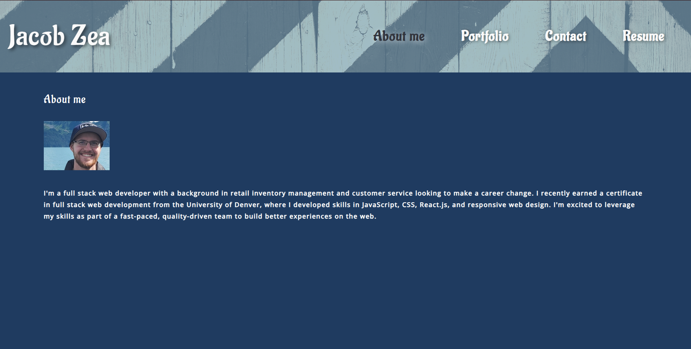

# react-portfolio

## Description 
This is the portfolio showcases my work as a web developor and is built using React. It contains a home page, a portfolio page, a contact page and a resume page. The portfolio page contains links to my deployed projects. The About Me page contains a breif bio and a photo of myself. The Resume page contains a link to my resume and a list of my skills. The Contact page contains a form that allows the user to send me a message. 

## License 

## Table of Contents
- [Installation](#installation)
- [Usage](#usage)
- [License](#license)
- [ScreenShot](#screenshot)
- [Link to Deployed App](#link-to-deployed-app)

## Installation 
To install this app, clone the repository and run `npm install` in the command line. Then run `npm start` to start the app. 

## Usage 
This app is used to showcase my work as a web developer.

## ScreenShot

## Link to Deployed App
https://JacobZ96.gitbub.io/react-portfolio

## Questions
If you have any questing please contact me at jacobzea96@gmail.com, and you can find more of my work at https://github.com/JacobZ96. 
